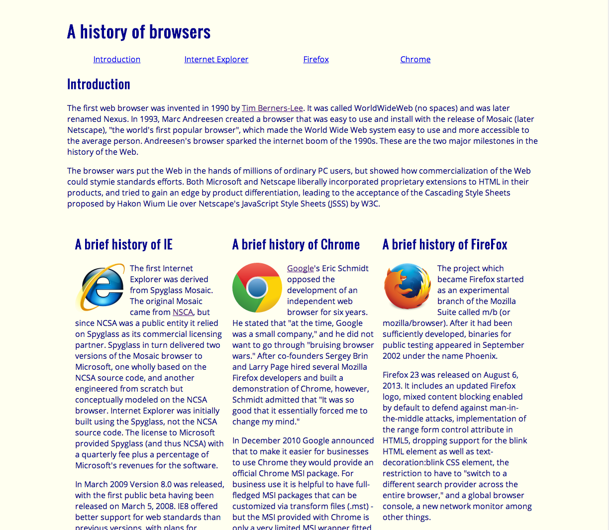

**What is it?**

Semantic UI is a UI (user interface) Framework that is a toolkit to help design things such as website pages for example. 
It has built in instruments that can be used to make your designs more neater and cooler! I for one am grateful for the people
who designed this for other people to use and making website designs easier. Before we started the week of learning UI Frameworks, 
I had no clue on how to make websites let alone using a tool to help make things easier. 

The first week there were no tools to help us design web sites. It was all manually coded instead where it was not hard to do but it was
very time consuming. I had to go back and forth between two sections where one section was the code itself and the other page was a page
where how I wanted my designs to be like. For example, designs may include the fonts of your words, or how large or small you want them, 
or even the color of the text or background. This was the result of my experience of a 100% manual code input for a website design.

**I leveled up and learned a skill! Semantic UI**

After a week, I had grasped the basics of it by learning HTML and CSS to successfully do website designs. In the second week however, 
learning Semantic UI is so much helpful. It is a built in way to make designing websites easier so it is less of a hassle. It was a 
bit hard to learn and grasp at first but later on I understood it better and making sites was so much easier. It can be a pain if you
do not know how to use it and understand why it is it used in such a way. As I was learning the Framework, the class tag for 
things like paragraphs or a menu item in the menu has to be labeled correctly or else it will look weird and leave you to wonder why 
is this happening. After these two weeks, the experiences I encountered will pay off as I continue to use this.

**Final Thoughts**

I am sure there are other frameworks besides Semantic UI, but this is the only one I have learned so far and it is fun to play with
to make custom websites. Overall, the option to use these frameworks will help immensely. People took the time to make these so we can
all use them so why not use them? These are great tools for someone interested in designing things such as websites. You can choose to not
use them and just straight up code it in HTML and CSS if you want to but you will be missing out on a great tool.