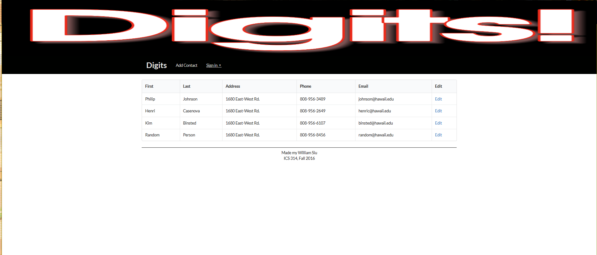
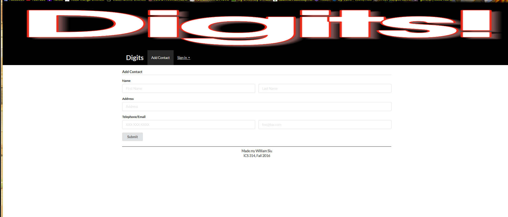
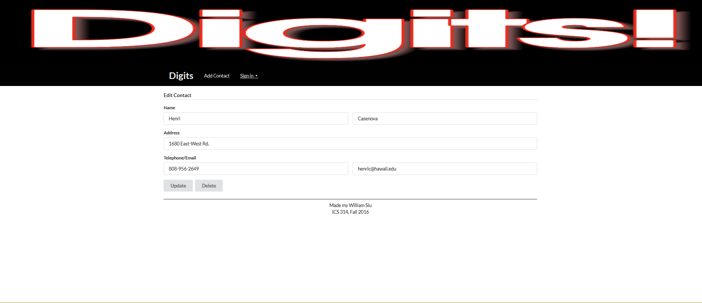
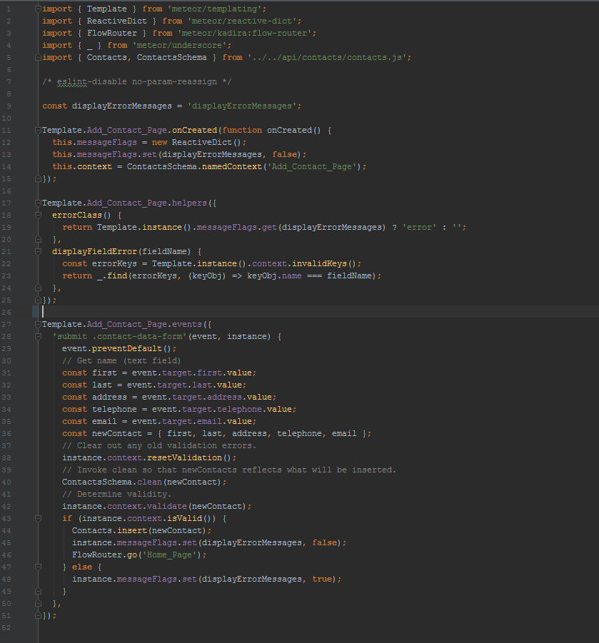

**Direct Hit!...Twice!!!**

In the first two weeks, learning this was such as struggle personally. I may as well have been hit in the head twice by Meteor! The program Meteor is another type of Framework where it allows one to code and display
pages and have user type capabilities when interacting with it. When first introduced to it, I thought I was going to not like it due to it 
explaining a lot and in the first week it did feel like my head got hit with a meteor....maybe two. I'm sure there are some that do this, but I 
used a desktop and a laptop to do my work with meteor these past couple weeks and doing that was a fraction of the pain meteor caused me when I
started understanding it. 

**Meteor is pretty cool**

Luckily before Meteor, I picked up on HTML and CSS style of coding for frameworks really quick and learned Semantic UI style easily as well. Meteor also 
involved using HTML and CSS coding languages which I felt like that was not a problem. The only really difficult thing is that when referencing code from 
other templates there were some misplaced lines that caused problems and took forever to figure out why and then feel stupid afterwards. For example, I had a 
moment where I placed a button in a different line and did not know why the button would not work when I went to test it. I do feel like the HTML and CSS part
of meteor was not as hard as I thought.

However, the javascript part was messing up my head a lot. If it were for not having the examples given to use as reference, I do not think I would have ever thought
of using javascript like that to add functions for dealing with user interaction abilities like options to add, remove, update things like in the picture below.

As I finish the semester where I was taught meteor from one of my classes, I still feel like I do not fully understand it but luckily I have the references to keep staring at in hopes of one day fully understanding.
Maybe its due to the fact I am still learning javascript since I was recently introduced to it so I guess its a matter of just keep using it differently. The adding
function was quite mind boggling at first and without guidance, I feel it would have been near impossible to do it within the time frame I managed to complete it with
the guides and references I was able to use. The image below is code for just making adding an option and allow you to interact with it but it surprised me sort of due 
to not knowing javascript could be used like that.

**Aftermath of being Meteors Impact**

I may still be dazed by its damage but I like Meteor. Being able to use this to make web pages and able to view and have it automatically refresh as well was pretty cool compared to when earlier I had to manually hit refresh every time when I want to see the current progress when I was prior to using Meteor. 

The problem at first was having problems running it through the command prompt. After working out the kinks, I was able to get it working and run every time I wanted to use it to work on something. It is pretty sweet that as you keep making changes, the command prompt will notice it and rebuild the site for you to view the changes in moments!

However, sometimes it does seem slow and since I do use a desktop and laptop, I have to keep updating the local files from the remote every time manually and I fear it may cause a problem with Meteor but hopefully it is
not the case! Unfortunately, my laptop runs Meteor at a slower pace than my desktop in my opinion but this may be because my desktop is more powerful and custom builds include having
32 GB of RAM versus an 8GB on my laptop. 

**Revelation**

Later on near the end of the semester for the class, I learned that you can hit a simple button to update your files locally if you are using different devices. Instead of what I was doing earlier, this is much simpler and less of a headache! I wish I knew that before hand and not spend about 3 minutes doing my old method where you delete it, download the remote to local, reinstall meteor stuff and continue my work! Such a life saver!