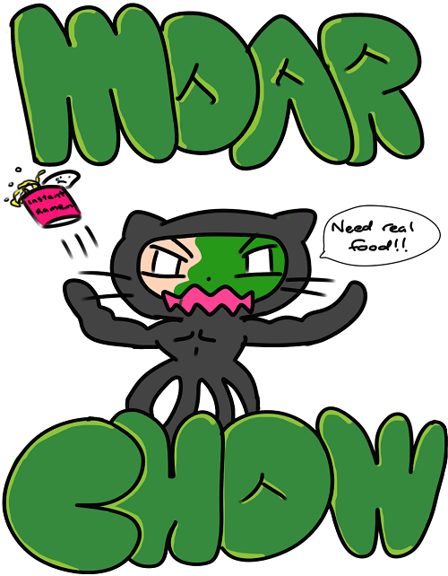

**Our Web Application**

 Near the end of the second half of Fall 2016, a class I took for Computer Science where we were grouped in teams to work on a web application project that was about three weeks long. My team created the web app called MoarChow, which is a food application where a student in the University of Hawaii can view both foodtruck and various food establishments across the Manoa campus. They are able to view their business hours and menu prices of their items, give a rating on the vendors, and also view a map in our application to see where each vendor is for guidance. 

**Contribution**

When I created the Logo for our web app, I tried to think of an aspect from being a college student myself. If I were a college student trying to conserve on money for food, I would probably buy cup ramen. The logo is suppose to represent that cup ramen isnt satisfying enough anymore and real food is needed to quell the rage of cravings.

Though it was technically everyones job, I looked through to make sure that our web application was accurate in terms of hours, prices, food category, and map location due to being such a large database, anyone could have made a typo. Aside from that and the logo, my contributions to the project were 
<li>suggest a rating system</li>
<li>gather database information needed for various vendor places that my group split up the locations</li>
<li>being able to log in and making sure only logged in users can view the web app outside of the landing page
<li>finding users to test our web app</li> 

**Looking back**

I learned quite a few things from this experience but if I were to pick one thing, a big thing is that it was difficult to work in teams where everyone wants to push their code to the main branch on our github page. Sometimes someone pushing a change caused problems for other teammates and would take time to figure out what went wrong. That happened a lot in the early phase when our group was doing work and it was quite frustrating. Eventually we got things to work and when someone made changes to the main branch, the others would not have any problems and they could do the same. 

I do not think I could have got our app to where it is now if I were to solo this by myself within three weeks.

Click <a href="https://moarchow.github.io/">here</a> for more details on MoarChow.